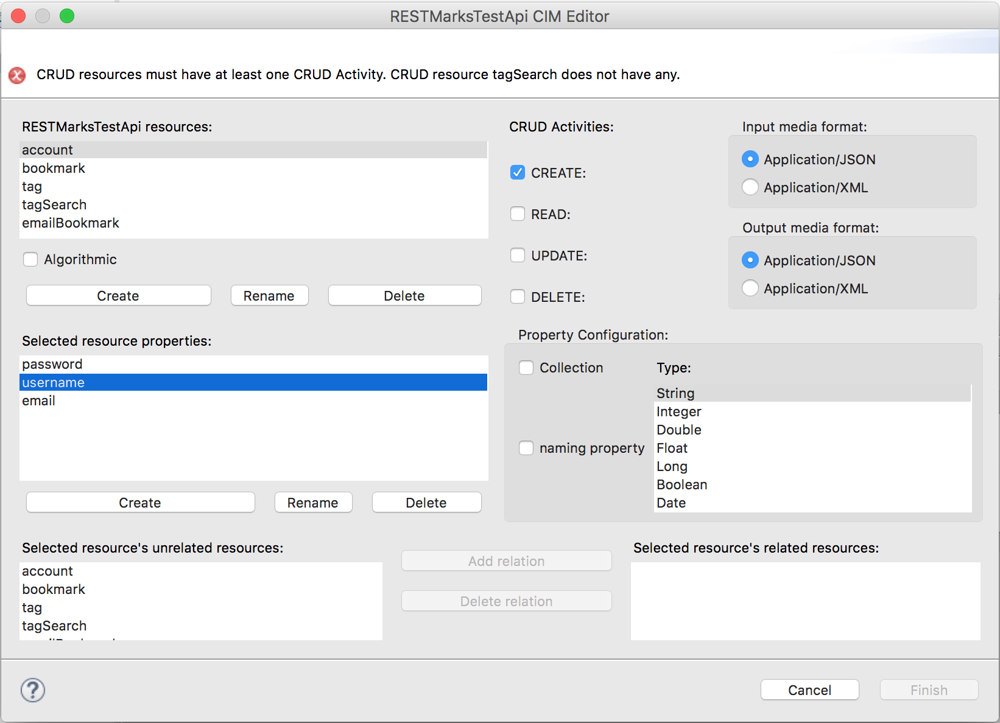
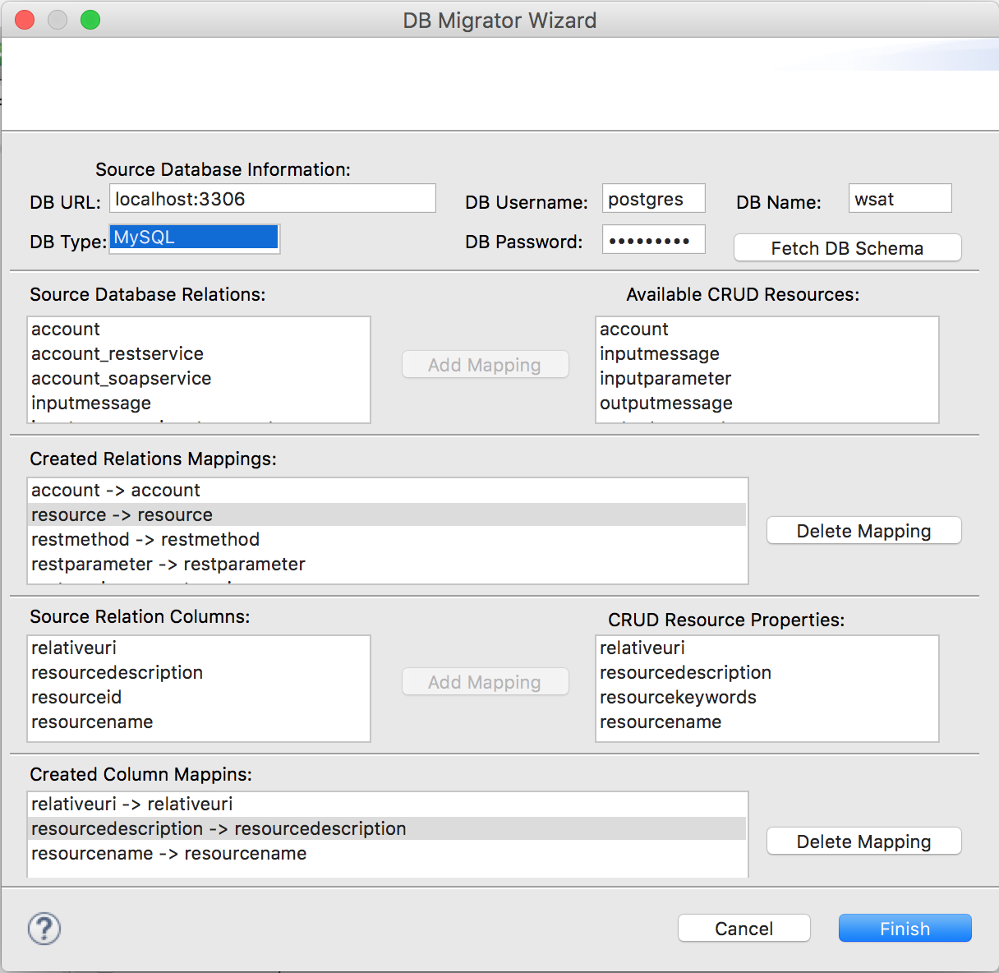

### Code Generation

 

The final step in order to produce a Web Service using S-CASE, is to run its code genration engine and interact with its User Interface, which is provided in the form o Eclipse Wizards. These Wizards help the S-CASE developer to provide the required input in a valid way so that the code generation engine will output a compilable and executable Web Service. The following subsections document the configuration and use of the S-CASE code generation egnine.

 

#### Configuring the Code Generation Engine

 

As the Getting Started section of this Web Book describes, any code generation configuration takes place in the Code Generation configuration page that can be found by right clicking on a project, then selecting "Properties" and then by clicking the "Code generation" page under the "S-CASE" option. The figure below illustrates all the available options:

 

- **The Web Service name** field requires the desired name for the output Web Service that will be produced. It has to be one word and a valid string to be included in the generated java package path, e.g. without spaces and all letters are lowercase.
- **The Output Path** field specifies a folder in which the code generation engine will output the Web Service genrated code and any intermediate artefacts.
- If the **Import generated project to workspace** check box is selected, S-CASE will automatically import in the workspace the generated Web Service project each time the code generation engine is executed.
- The **Database** drop list provides the available database types options to select from.
- The **Database server address** field holds the full url to the database server through which the generated Web Service will handle its database.
- The **Database server port** field holds the port at which the database server expects incoming requests.
- The **Database username** field requires the username of the user account through which the generated Web Service will be able to access its database. It is important to note that the provided user account must have all the rights to create, update, read and delete a database and any relations it comprises. If the specified rights are not provided the generated Web Service will fail to function properly.
- The **Database password** field requires the password of the user account that will be used by the Web Service to interact with the specified database server.

 

The rest check boxes configure the generation engine to pop up the required Wizards so that the S-CASE developer will be able to add more functionality other than a plain RESTful Web Service. The options are explained below:

 

- **Basic Authentication:** This option when checked, pops up the Basic Authentication Wizard when the code generation engine is executed. This Wizard allows the S-CASE developer embed wide-spread username/password authenticaiton to the generated Web Service.
- **ABAC Authorization:** This option when checked, pops up the Attribute Based Access Control Authorization Wizard, which allows the S-CASE developer to embed high level and fine grained authorization rules to his generated Web Service. This functionality will be released shortly.
- **Database Searching:** This option when checked, pops up the Database Searching Wizard, which allows the S-CASE developer to select some resources of his envisioned Web Service that will embed wide-spread database keyword searching.
- **External Compositions:** This option when checked, pops up the External Compositions Wizard, which allows the S-CASE developer to model interactions of some resources of his envisioned Web Service with existing Web Services that are live on the internet, either created by the Service Composition Plugin of S-CASE or are 3rd party ones.
- **Database Migration:** This option when checkd, pops up the Database Migration Wizard which allows the S-CASE developer to model a mapping from an existing database to the new one that will be created once the generated Web Service is executed for the first time.

 

 

#### Running the Code Generation engine

 

Once the S-CASE developer is done with providing any Textual Requirements or Web Service Compositions using the other S-CASE eclipse plugins, it is time to run the Code Generation engine in order to produce the envisioned Web Service. To do so, there are two available options:

 

- **The Generate Code button:**  This option allows the S-CASE developer to start the Code Generation engine from scratch, namely to take as input the textual requirements and/or modeled Web Service Compositions. Note that this is the only available option in the first run of the Code Generation engine for an S-CASE project. This is the only available option in the case the S-CASE developer wants to make changes to his Textual Requirements and/or Service Compositions.
- **The Re-generate Code button:** The Code Generation engine embeds the required functionality to save the changes the S-CASE developer makes when using the Code Generation Wizards. This allows the Re-generate Code button to re-run the Code Generation Wizards, pre-filled with all the input the S-CASE developer has provided to it during the last Code Generation Engine execution. Note that in this case, any changes in the Textual Requirements and/or Service Compositions are ignored.

 

#### The REST editor

 

No matter what code generation preferences the S-CASE developer has selected in the corresponding configuration page, the first Wizard to pop up once the Code Generation engine is started  is the REST editor. This editor helps the developer to correctly model his envisioned RESTful service. Through this Wizard, the developer scaffolds the structure of the whole Web Service that can be later enhanced with more specific functionality using the rest Wizards. The components of this Wizard and their explanation follow bellow alongside two figures that illustrate its state in invalid and valid status:

 

 

- **Error Notifications:** At the top of the Wizard the Code Generation engine displays error notifications to the developer in order to inform him about any invalid input that is detected by it. Such error notifications also provide a helpful tip to the developer on how to fix the detected error.
- **Resources:** In this section the wizard lists all the Web Service's resources. Once a resource is clicked the whole wizard page displays its details, namely input/output representations, CRUD API, properties and relations that are all explained later. A developer may create or delete a selected resource by clicking one of the Create resource or Delete resource buttons. If the user checks the Algorithmic option, then the selected resource will be treated by the Code Generation engine as one that runs some sort of custom algorithm rather than a plain data holder "CRUD Resource" that allows only the primitive Create, Read, Update and Delete actions on the specified modeled data it holds, as the REST architectural style specifies.
- **CRUD Activities:** This section lists the possible CRUD activities that a resource may have, conforming to the semantics of the common web HTTP API that REST commands, nameley the CREATE activity is used to create an instance of a resource, the READ to retrieve an existing one, the UPDATE to update an existing one and finally the DELETE activity to delete an existing resource. The Code Generation engine will automatically add any activity to the envisioned system that the developer has checked.
- **Input/Output media format:** This section allows the developer to select the desired input or output representation media format of the selected resource. The available representations are application/JSON and application/XML.
- **Properties:** This section lists all the properties of the selected resource. The developer may create new or delete existing ones by clicking the Create property or Delete property button.
- **Property Configuration:** This section provides the configuration details of the selected property. If the Collection option is checked then the property will be an Array, otherwise it will be a Java attribute of multiplicity one. From the Type list, the programmatic data type of the selected property can be defined. Finally, if the naming property option is checked, the envisioned system will use the value of this property for every resource list it sends to its clients for differentiation purposes.
- **Unrelated Resources:** This section lists all the detected resources that are not related to the selected resource.
- **Related Resources:** This section lists all the detected resources that are related to the selected resource. One may move one resource from one list to the other by clicking the button Add relation or Delete relation. Note that when such a relation from a resource A to a resource B exists, it should be translated as "Resource A has Resources of type B". At the moment the supported type of such relationships is one to many, although many to many relationships will be also supported.

 

Once the developer makes any desired modifications using the REST Wizard and fixes any detected errors the Error Notification area becomes blank and the Finish button is enabled. By clicking the Finish button this Wizard is terminated and the code generation process begins or the next Wizard pops up depending on the code generation preferences. The following figure illustrates the REST wizard in its valid state.

 

 

#### Basic Authentication Wizard

 

The Basic Authentication Wizard is the first to pop up after the REST Wizard, if the developer has configured the Code Generation engine to embed Basic Authentication. This Wizard comprises two pages. The first one follows below and has the following components:

 

- **Authentication Model:** This section lists all the available resources that can be used by the envisioned system as Authentication Models. Instances of this resource will contain authentication data during the execution of the envisioned system. Only CRUD Resources can be selected as Authentication Models, since they are the only type of Resources that have attributes.
- **Username Token:** Once a resource is selected as an Authentication Model, its attributes become available as possible username tokens. From this list, the S-CASE developer has to pick one property of the selected Authentication Model, that the envisioned system will use as username. The property to be used as username token must be of type String and of multiplicity one.
- **Password Token:** Once the S-CASE developer has selected a Username Token, the rest remaining attributes of the selected Authentication Model are available to be selected as Password tokens. The envisioned system will use this Password token for password data. The property to be used as password token must be of type String and of multiplicity one.

 

 

Once the developer successfully selects an Authentication model and its corresponding username and password tokens the Next button is enabled to proceed to the next Basic Authentication Wizard page. This page allows the developer to define the desired Authentication Mode for every CRUD activity of all the Web Service's Resources. Its components are the following:

 

- **Web Service Resources:** This section lists all the resources of the envisioned system. The developer has to select one authentication mode for every CRUD activity of each resource. Only once this is done, the Finish button is enabled.
- **Authentication Mode:** This section allows the developer to select the Authentication Mode for every CRUD Activity of the selected resource. If the All option is selected for a CRUD Activity, then both authenticated users and guests will be able to access its functionality, otherwise only authenticated users will have access to it.
- **Apply To All - One click Authentication:** This section provides a quick way to set-up the authentication mode of all the envisioned system’s CRUD Activities with one click. Hence, in order to allow All to access any CRUD Activity of the Web Service, one should select the All option and click the Apply to all button.

 

 

#### Database Keyword Searching Wizard

 

The Database Keyword Searching Wizard is triggered according to the Code Generation engine configuration either after the REST Wizard or the Basic Authentication one. This Wizard comprises the following components:

 

- **Available Resources:** The upper half of the wizard page comprises two lists. The left one lists all the available resources that could embed a database-searching algorithm. Since these resources will execute an algorithm, only algorithmic resources are listed as Available Resources. The right list contains the resources that are already marked as Search Resources. In order to move a resource from one list to the other, the S-CASE developer can click the Add or Remove button.
- **Create Search Resources:** The lower half of the wizard page allows the S-CASE developer to formulate a set of resources/properties that the selected Search Resource must be able to search by keyword. Hence, at the left list the developer has to select one resource, some properties of which must be searchable by the selected Search Resource. Then the next list provides its properties. The developer may add or remove such properties to the rightmost list of searchable properties by clicking the Add/Remove button. It must be noted that the developer is able to add any number/combination of searchable resources and properties to each Search Resource.

 

The following figure illustrates an instance of the Database Keyword Searching Wizard

 

 

#### External Service Composition Wizard

 

The External Service Composition Wizard is the last one to pop up, if the Code Generation engine is configured to embed such functionality. This Wizard comprises two pages. The first one allows the developer to model the external composition entpoint to be accessed by the generated service alongside its input/output. The second page is usefull only when there exists an attribute of the input and/or output model that is of complex data type. Such a case is explained in depth in the next section, Modeling Complex Datatypes. The following figure illustrates the first page of the External Service Composition Wizard, which comprises the following components:

 

- **Available Resources:** The Available Resources list, lists any algorithmic resources that are not already marked as Search resources. Any of these resources can be used as a RESTClient Resource so as the Code Generation engine automatically creates the required code in order to be able to interoperate with the specified external service.

- **RESTClient Resources:** This list on the other hand, lists any alogirthmic resources that are already selected as RESTClient Resources. In order to move resources between these two lists, one may use the Add and Remove buttons.

- **External Composition Setup:** This part of this Wizard contains the entpoint to be accessed information, namely its full URL, the CRUD verb to be used in order to interact with it as well as any required query parameters. The S-CASE developer is able to create, rename or delete such query parameters with the respective buttons.

- **Input/Output Data Model:** The input and output data model parts of the Wizard comprise the required fields in order to input any information regarding the expected input or output data to/from the external composition. For each case the media format has to be specified, which can be either application/JSON or application/XML. The developer must also specify any properties that will be included in the body of the request and their data type.

- **Persisting Output to local database:** When this check box is selected, the response of the external composition will be persisted to the web service's local database. In case there exists a CRUD Resource that fully models such a response it can be used by selecting the **"Existent"** type and then the resource at task. Otherwise, the **"Auto"** type creates automatically the required Java code and underlying database structures so as to persist the external composition responses.

 

 

#### Modeling Complex Datatypes with the External Service Composition Wizard

 

In the case some input or output model attribute of a modelled external composition is selected to be of complex data type, the S-CASE developer will also have to model it using the 2nd page of the External Service Composition Wizard. This section demonstrates how S-CASE developers should model the interaction of their envisioned system with existing 3rd party Web Services that return JSON/XML output with complex data types. The following steps have to be followed.

 

##### Analyze External Composition output

 

The very first step should be really a manual query to the 3rd party web service in order to elicit the response structure that has to be modeled. For the shake of this example, lets assume that the 3rd party web service response is as the figure below illustrates (example taken from http://json.org/example.html):

 

 

The next step is the decomposition of the response to its components. So, by observing this response, the S-CASE developer should conclude that it comprises a complex object named “widget” of some unknown Class (let’s name it **ComplexTypeWidget**). As one may observe, this Class comprises four attributes, one of type String named “debug” and three other objects of some other unknown classes, named **“window”**, **“image”** and **“text”**. Each of these have the following properties:

 

**“window”:** Lets name the complex type of the object named “window”, ComplexTypeWindow. Then it is obvious that this complex type comprises:

 

-	“title”: type String
-	“name”: type String
-	“width”: type Integer
-	“height”: type Integer

 

**“image”:** Lets name the complex type of the object named “image”, ComplexTypeImage. Then its components are:

 

-	“src”: type String
-	“name”: type String
-	“hOffset”: type Integer
-	“vOffset”: type Integer
-	“alignment”: type String

 

**“text”:** Finally lets name the complex type of the object named “text”, ComplexTypeText. This one comprises:

 

-	“data”:  type String
-	“size”: type Integer
-	“style”: type String
-	“name”: type String
-	“hOffset”: type Integer
-	“vOffset”: type Integer
-	“alignment”: type String
-	“onMouseUp”: type String

 

##### Modeling the complex output with External Composition Wizard

 

Once the output of the target Web Service is analyzed, its time to model it with the External Composition Wizard. Once the UI appears, the desired algorithmic resource of the envisioned system, which will have to interoperate with the external composition service should be selected and added to the RESTClient Resources list. This is demonstrated in the figure below. In this case, we will use the resource named “externalServiceWithComplexOutput” as the one that will interoperate with the 3rd party service. Once it is selected, the S-CASE developer will have to fill in any other needed information like the 3rd party service’s URL, the CRUD verb to be used while interacting with it and any query parameters or input that it expects as described in the previous section. In this example, since the focus is on modeling complex output, the imaginary 3rd party Web Service does not require any input query parameters or input.

 

 

Therefore, the next step is to model the output. As we have already concluded, the output of the Web Service comprises a complex type object named “widget”. Hence, we create an output property named “widget” and select “complex” as its type. In case the output model had more output properties of either primitive or complex type, they should also be added at this point. Once all the output properties and their respective data-types are defined the S-CASE developer may click on the “Next” button.

 

In the next page of this Wizard appears a list of the created RESTClient Resources. The S-CASE developer will have to define any complex data type of each such resource the way that is demonstrated in this example for the “externalServiceWithComplexOutput” resource.

 

The figure below illustrates the very first steps, once the desired RESTClient Resource is selected. The S-CASE developer should click on the create button and insert one by one all the complex type names that where detected previously. In this case, these names are ComplexTypeWidget, ComplexTypeWindow, ComplexTypeImage and ComplexTypeText. Then, each output property should be linked to one of these types. In this case the desired data type is the ComplexTypeWidget one.

 

 

The final step is to define the properties of each complex type. These can be of primitive or of complex type as well. The following figure illustrates the complex type ComplexTypeWidget properties modeling. To model it, the S-CASE developer has to create its properties, while the ComplexTypeWidget is selected. In this case these are the “debug” property linked to String data type from the Available Types list, the “window” property of type “ComplexTypeWindow”, the “image” property of type “ComplexTypeImage” and the “text” property of type “ComplexTypeText”. Then the S-CASE developer, should click on the next complex types and add their properties as well, which have already been identified in the previous section and are all of type String and finally click on Finish.

 

 

The produced service by the Code Generation engine will then automatically interoperate with the 3rd party service, decompose its output, store it in the local database, if so selected, and then repackage the output and send it to its client.

 

##### Final Notes

 

-	If the client needs only a subset of the output model, the rest properties (either of primitive or complex data type) can be omitted and not modeled in the Wizard.
-	However, (for time being) the developer has to make sure that the 3rd party service always returns the values of all the properties that are included in its output model through the External Service Wizard, otherwise it might not function properly.

 

#### Database Migration Wizard

 

The Database Migration Wizard is triggered at the end of the modelling process with the Code Generation Wizards. This Wizard comprises the following components as the following figure illustrates :
 

 

- **DB URL:** The DB URL UI control requires the complete URI to the source database server from which the migration will take place. The S-CASE developer must provide the IP:Port pair e.g. localhost:3306.
- **DB Type:** The DB Type list allows the S-CASE developer to select the type of the source database. The supported types are MySQL and PostgreSQL.
- **DB Username:** The DB Username control requires the username with which the Code Generation Engine will connect to the source database. It must provide the appropriate rights so that the Code Generation Engine can list and read the required source database.
- **DB Password:** The DB Password control requires the password for the provided username that will be used to connect to the source database.
- **DB Name:** The DB Name is the name of the source database.
- **Source Database Relations:** The Source Database Relations control lists all the detected relations of the source database, once the S-CASE developer clicks the Fetch DB Schema button.
- **Available CRUD Resources:** The Available CRUD Resources control lists all the CRUD Resources that the S-CASE developer has created in the REST Wizard.
- **Created Relations Mappings:** The Created Relations Mappings control lists any source relation to CRUD resource mappings that the S-CASE developer has created. Such mappings provide the Code Generation engine with the required information to know from which source relation it should fetch data in order to fill in the target database relation of the selected CRUD Resource. The S-CASE developer may select any combination of source relations - CRUD resources, but each combination must be unique.
- **Source Relation Columns:** The Source Relation Columns control lists all the detected columns of the selected mapping source relation.
- **CRUD Resource Properties:** The CRUD Resource Properties control lists all the properties of the selected mapping CRUD resource that the S-CASE developer has modelled in the REST Wizard.
- **Created Column Mappings:** Once the S-CASE developer selects a source column and a target property and clicks the Add Mapping button, a new Column Mapping is created and added to the Created Column Mappings list. Such mappings provide the Code Generation Engine with the required information as to which source column data to migrate to which target CRUD Resource property.

 

##### Source Database Prerequisites

- The source database must contain valid referencial keys for any 1 to N relationship it comprises.
- In case the source database comprises also M to N relationships, it must provide appropriate JOIN Tables. Hence, JOIN Tables must have all the required foreign keys to the corresponding relations primary keys **and** have as primary key the combination of the aforementioned foreign keys.
 

##### Remarks on Database Migration process

- The Source Relations are not required to have the same name with the target CRUD resources.
- The Source Columns are not required to have the same name with the target properties.
- The Source Relations and Columns may be used in mutliple mappings should this is desired.
- In case there exists a mapping to a CRUD resource that is related resource of some other CRUD resource, another mapping is also required from the "parent" source relation to the the parent CRUD resource of the specified mapping.
- In case the S-CASE developer has also opted to use the Database Keyword Searching functionality, the code generation engine will index during the migration the old data, hence it is going to be searchable the desired in the generated Web Service.

 

##### Performing the database migration:

In order to perform the actual database migration once the Code Generation Engine has finished executing the S-CASE developer will have to do the following:

 

- Navigate to the output folder of the specified project.
- In the output folder the Code Generation Engine places a new maven project named as <ProjectName>DBMigrator. The S-CASE developer will have to compile the specified maven project using the "mvn package" command.
- Then executing the generated java application the actual migration will take place. Indicative invocation from command line once in the top project folder: "java -jar target/<ProjectName>DBMigrator.jar"
- If the S-CASE developer opted to include Database Search functionality, the generated Lucene indexed will be added in a folder named <ProjectName>LuceneIndexes. The S-CASE developer must copy this folder and paste it in the webapps folder of the underlying Jetty/Tomcat application and the start the envisioned Web Service.

 

 

#### Handling M to N relationships of CRUD resources.

 

A Web Client that interaccts with a generated Web Service of S-CASE can utilize the extended PUT Web API of each CRUD resource in order to add more relations towards parent or child resources of the specified one. The extended PUT Web API comprises the following query parameters:

 

- **strOptionalUpdateRelations:** This query parameter specifies wether the generated service should update the underlying CRUD resource's relationships or not. Should the client wishes to add/remove a relationship to/from the underlying CRUD resource, it should set this query parameter to the **string value "true"**. Otherwise, it should be set to false or not included at all.
- **strOptionalUpdateParent:** This query parameter specifies wether the generated service should update the parent or child relationships of the underylying CRUD resource. Should the client wishes to add/remove a relationship to/from an existing parent resource, it should set this query parameter to the **string value "true"**. Otherwise, if it wishes to add/remove a relationship to/from an existing child resource, it should set this query parameter to the **string value "false"**.
- **strOptionalRelationName:** The strOptionalRelationName query parameter requires the name of the CRUD resource to which a relationship will be added to/removed from the underlying one.
- **strOptionalAddRelation:** This query parameter specifies wether the generated service will add or remove a relationship to a parent/child resource of the underlying CRUD resource one. Should the client wishes to add a relationship, it should set this query parameter to the **string value "true"**. Otherwise, if it wishes to remove a relationship of the underlying CRUD resource it should set this query parameter to the **string value "false"**.
- **iOptionalResourceId:** The iOptionalResourceId query parameter requires the Integer value of the id of the parent/child resource to be included to the relationships of the underlying CRUD resource.

 

More information on the Model Driven Engineering process:

 

- [Webinar on the S-CASE MDE engine](https://youtu.be/YuyeZlMW8_Y)
- [Demos of using the MDE engine through the S-CASE plugin](https://youtu.be/DFoeUFUlBDI)
