### Getting started

#### Installation

Your first step is to install the S-CASE Eclipse plugin:

1. Download & start Eclipse IDE
2. Select the menu item Install new software...
3. Add as a new remote repository the URL: https://eclipse.scasefp7.com/eclipse/s-case_update_site/

#### The Dashboard
The dashboard is a view in Eclipse.
It consists of buttons organised in four groups: Design, Mashup, Code, Run.

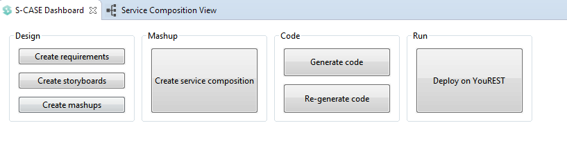

Design has the buttons for requirements, storyboards and mashup creation.
- Create requirements will create a new .rqs file in a given container (either project or folder). That file can be modified using Requirements editor, for more details see the [manual](https://s-case.github.io/manuals/Requirements%20Editor%20User%20Manual.pdf)
- Create storyboards button will create a new .sbd file in a given container. Storyboard creator works with such files, his documentation can be found in the [manual](https://s-case.github.io/manuals/Storyboard%20Creator%20User%20Manual.pdf)
- Create mashups button will create a new mashup

Mashup group has only one button: Create service composition. It uses a given storyboard and creates a service composition from it.

Code group has two buttons: generate code and regenerate code.
- Generate code button opens a form in which we can specify the settings for code generation
- Regenerate code button will perform code generation using the previous settings

Run group has a single button: Deploy on YouREST. It opens the Deploy wizard which gives instructions on how to start the generated web service.

#### Project creation wizard

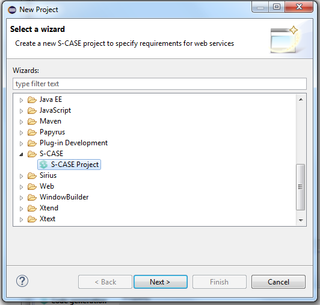

To create a new S-Case project, select S-Case Project from the New project wizard.

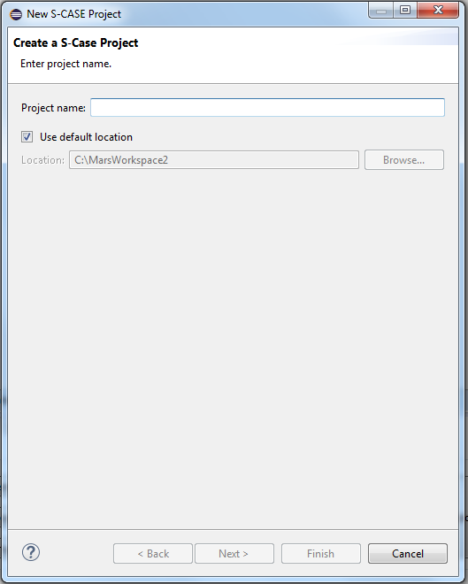

On this page you need to provide a project name, which has to be unique in the workspace.
You can also use the default location for the project or select a different one in the filesystem.

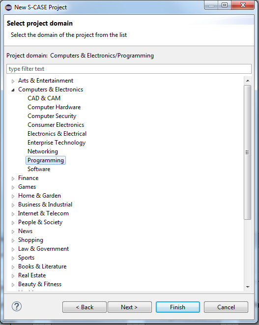

Now you can select a project domain for the project from the provided list.

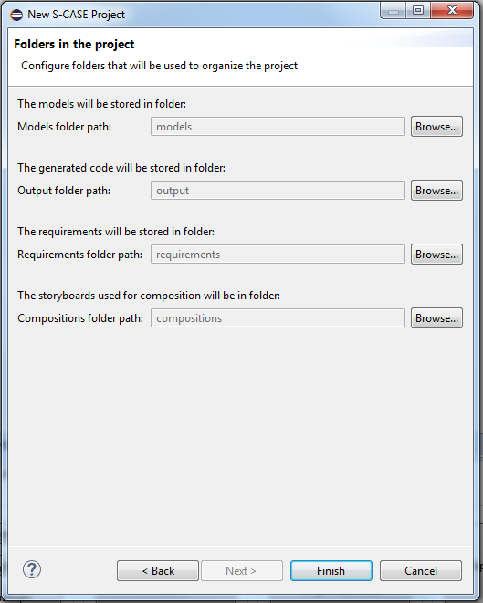

This page allows you to set the folders which will be used to organise the project.
They will contain the models, generated code, requirements and storyboards. You can select the exsisting folders or generate new ones.

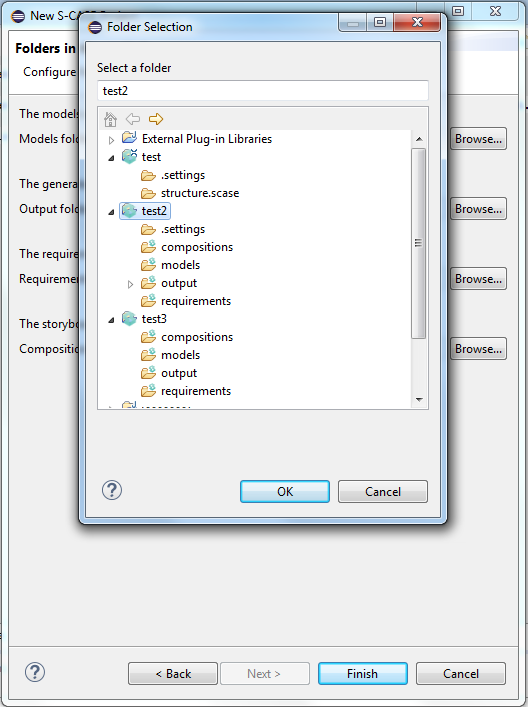

#### Project properties
To see the project properties, right click on a project > Properties, and then select S-Case category on the left.

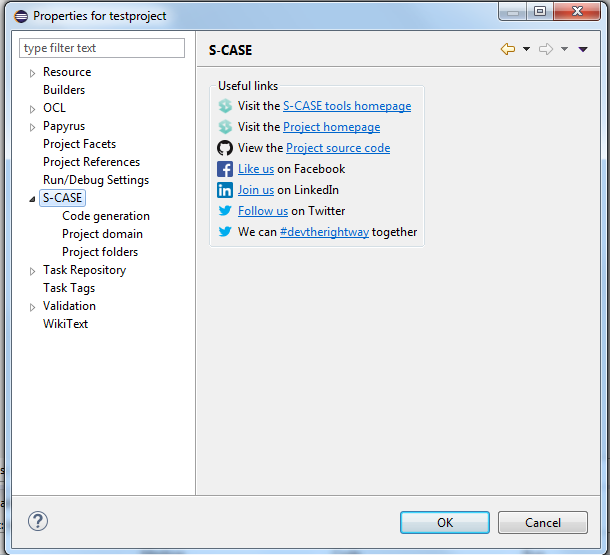

The first page has some useful links about S-Case.

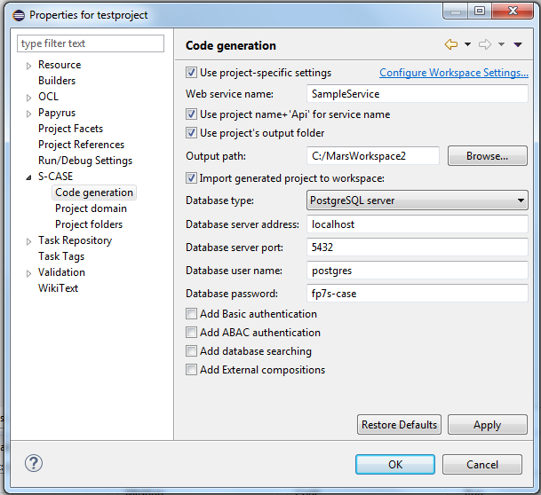

Code generation page configures the settings for code generation. By default, those are the same as specified in the workspace settings. When you want to provide the project-specific settings mark the checkbox.

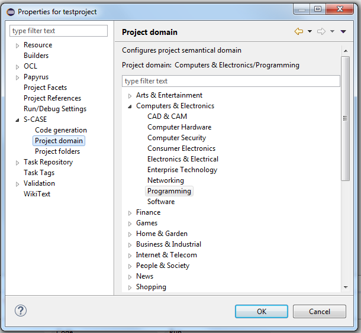

Here you can change the project domain.

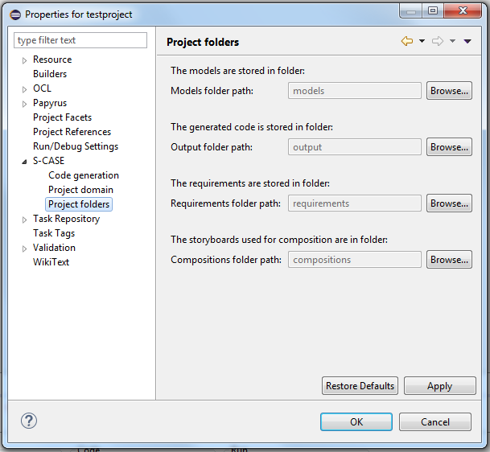

On this page you can configure the project folders.

#### Preferences

S-Case preferences have 3 sections: Code generation, Infrastructure services and Requirements editor.
Code generation page is similar to the one in Project properties.

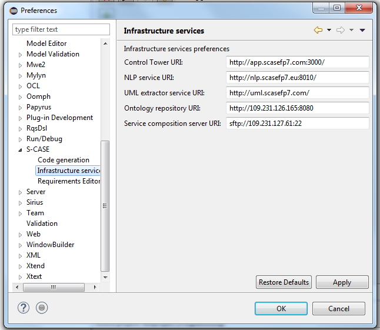

Infrastructure services page holds the various URI-s used for those services.

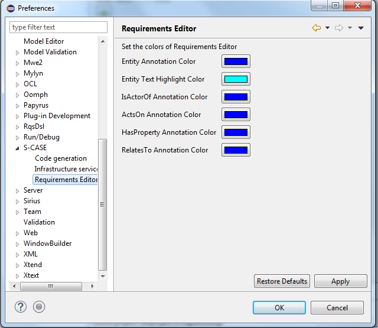

Requirements editor preference page enables you to change the colors used in the Requirements editor.
