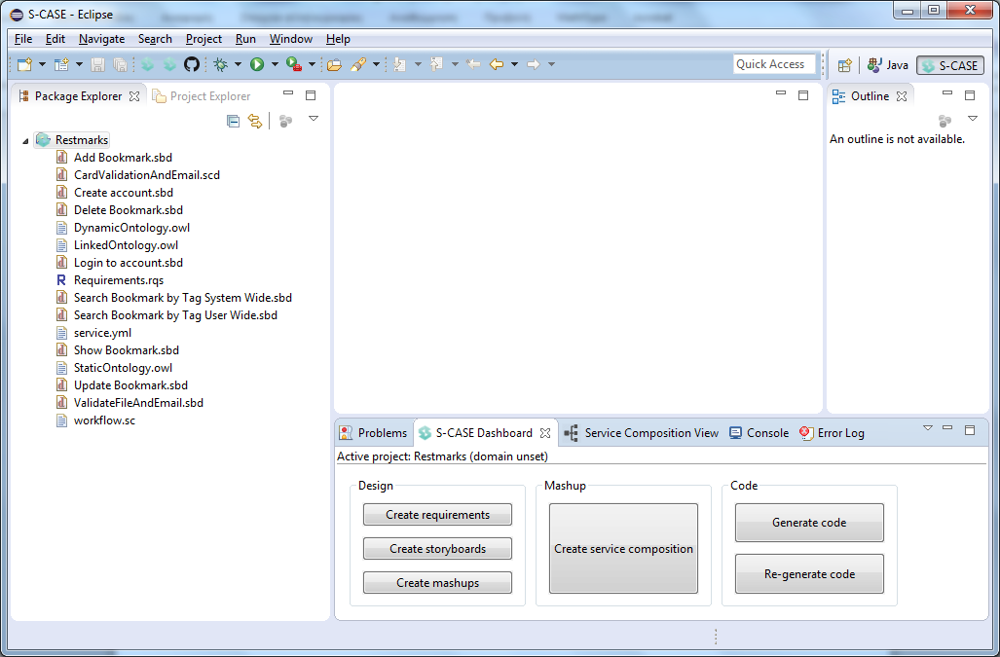
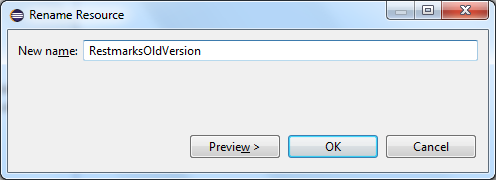
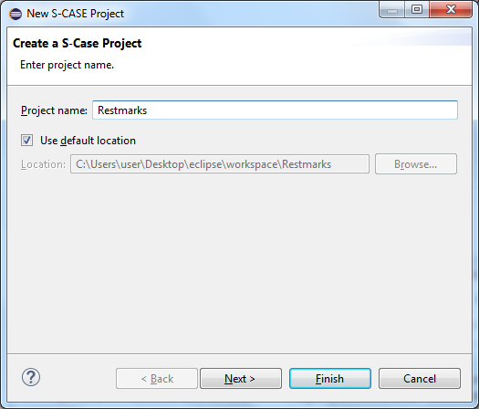
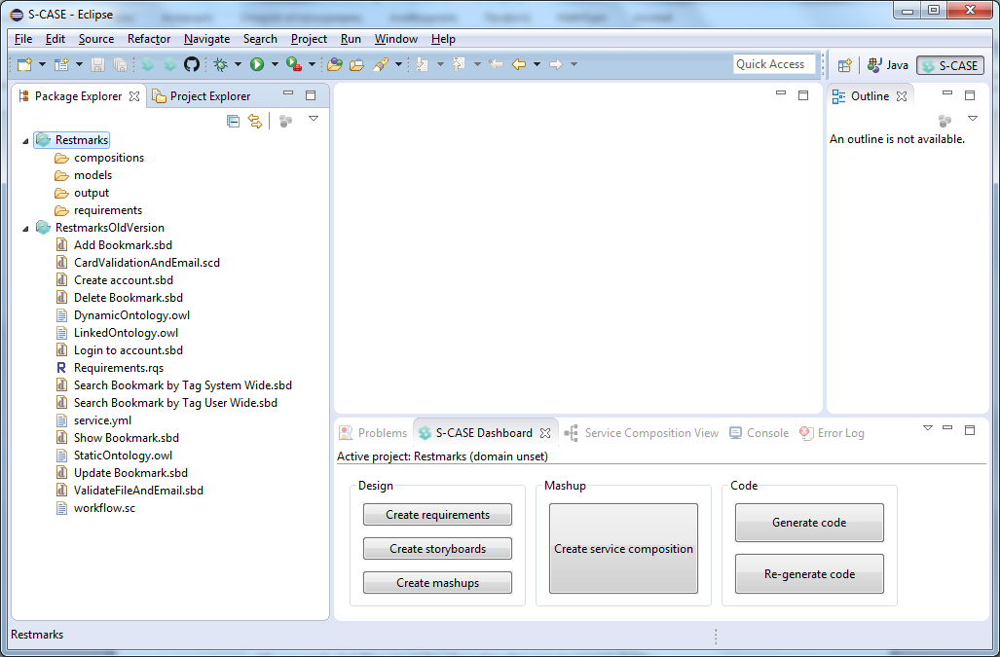
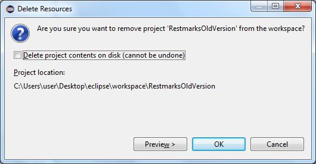
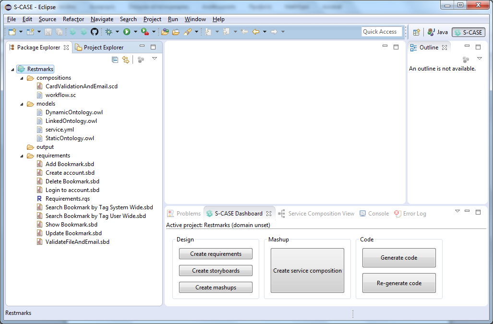

## Migration Guide from S-CASE Version 1.6 to Version 1.7

&nbsp;

#### Folder Structure Feature

This guide explains how S-CASE projects created with version 1.6 of S-CASE can be migrated to version 1.7. This procedure is required since version 1.7 and all subsequent versions are going to use the new folder structure. Support for old project-types is going to be dropped completely in short time.

An example of a project that is created using S-CASE version 1.6 is shown in the following Figure.

This Figure depicts project Restmarks, which has:
- an .rqs file
- several .sbd files
- an .scd file
- an .sc file
- three .owl files
- a .yml file

These files cover all possible file types existing in a project created with version 1.6 of S-CASE. Migrating the project to version 1.7 requires performing the following steps.

&nbsp;

#### 1) Rename the existing project
Press right-click on project and select Refactor --> Rename...
Then, set a new name for the project (e.g. ProjectNameBackup or ProjectNameOldVersion)

&nbsp;

#### 2)	Create a new S-CASE project with the desired project name
Press right-click on empty space and select New --> S-CASE Project

Note that the newly created S-CASE project is going to have 4 folders:
- compositions
- models
- output
- requirements

The current screenshot of the workspace should be as in the following Figure.

&nbsp;

#### 3)	Copy all the files from the old project to the new project
Each file must be copied in the appropriate folder:
- All .rqs and .sbd files must be placed in the requirements folder.
- All .scd and .sc files must be placed in the compositions folder.
- All .owl and .yml files must be placed in the models folder (or they can simply be deleted, since they are automatically generated by S-CASE).
- The output folder can include all folders and files generated by the Generate code command (or the output folder can be left empty, since the code can be re-generated)

The files can be copied by selecting them and pressing right-click and Copy and then navigating to the appropriate folder of the new project and pressing right-click and Paste. Alternatively, drag n' drop can be used to copy the files. If using drag n' drop, note that the Ctrl key must be pressed to copy (and not move) the files, and thus keep them also in the old project for future reference.

&nbsp;

#### 4)	Remove the old project from workspace
It is recommended to remove the old project from workspace since old S-CASE project are going to be deprecated. To remove a project press right-click on the project and select Delete. Note that it is recommended to keep the project in disk as a backup/future reference. So, be sure to uncheck the "Delete project contents on disk (cannot be undone)" checkbox, as shown in the following Figure.

Upon performing the steps detailed above, the final view of Eclipse should be as in the following Figure.

