### Requirements Modeling

The user of S-CASE can add software requirements in the following formats:
- Functional requirements in textual form;
- Graphical storyboards; and
- UML diagrams in the form of images.

The following sections provide an overview of inserting and annotating requirements for an S-CASE project.

#### Modeling Functional Requirements

##### Adding and Modifying Requirements

Functional Requirements are created and annotated using the Requirements Editor Eclipse plugin. To create a new rqs file, the user can either select the *Create requirements* dashboard button or open the *File* menu and then *New* and select the *Requirements Editor file* option.

Upon following the steps of the wizard to create a new rqs file in the project, the user may add the functional requirements in text form in the first page of the Requirements Editor, as shown in the following screenshot.

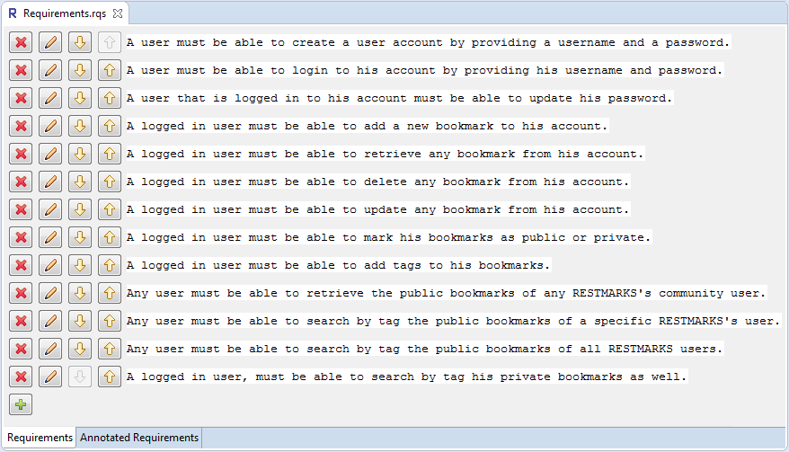

The user can add a new requirement by pressing the  button.

Requirements can also be deleted, using the  button, or modified, using the  button. Note than if a requirement is deleted or modified, the corresponding annotations of the requirement are also deleted.
Finally, requirements can be moved down or up using the  and  buttons.

##### Viewing and Modifying Annotations

Annotations can be viewed and modified in the second page of the Requirements Editor. An example showing an annotated requirements file is shown in the following screenshot.

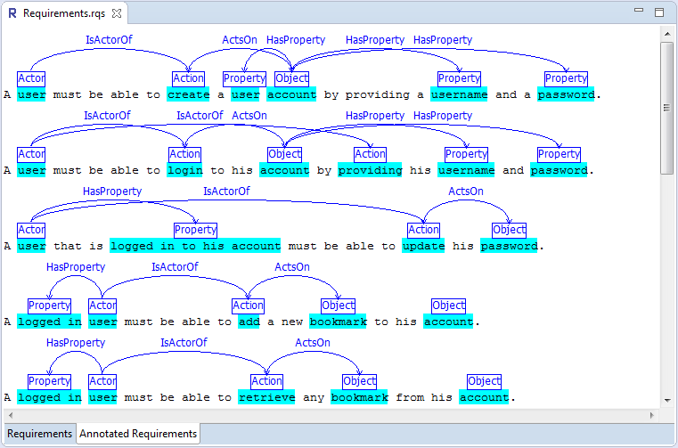

As shown in this screenshot, there are two types of annotations, *entities* and *associations*. Entities declare the type of each word (or phrase), and they can be one of:
- Actor
- Action
- Object
- Property

Associations declare the relations between different entities. The following relations are supported:
- IsActorOf, which is defined from an Actor to an Action;
- ActsOn, which is defined from an Action to an Object or from an Action to a Property;
- HasProperty, which is defined from an Actor to a Property or from an Action to a Property or from an Object to a Property;
- RelatesTo, which is defined from an Object to an Object.

Annotations are added and deleted using the right click context menu, while any modification of annotations is automatically saved to the file.

An entity annotation can be created by selecting a word or phrase and right clicking on the selected word. After that the user can select the appropriate entity from the context menu.

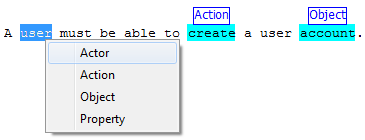

Associations are created by right clicking on existing entity annotations. The Requirements Editor automatically determines all possible associations from the currently selected entity and groups them in categories according to their type.

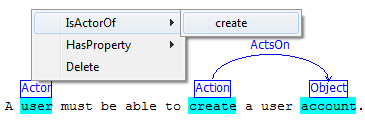

When no association is possible from a selected entity or any possible target entities are already selected, the tool does not allow selecting the association.

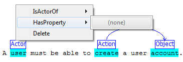

Finally, deleting an annotations is simple. One can delete an annotation by right clicking on it and selecting the option *Delete*. Note, however that when entity annotations are deleted, the related associations are also deleted.

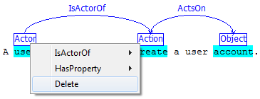

The Requirements Editor also supports automatically annotating software requirements using an NLP parser. This is performed by right clicking on the rqs file and selecting the option *Auto annotate*.

Note that when selecting this option all annotations are removed. Additionally, the user can select to clear the annotations of a file using the menu option *Clear all annotations*. This command is particularly useful if the user wants to modify the requirements in the first page of the editor.

Finally, note that automatic annotation should be used as a helpful complement; however it is important that the user inspects the annotations and modifies them if required.

#### Modeling Storyboards

##### Adding and Modifying Storyboards

Functional Requirements are created and annotated using the Requirements Editor Eclipse plugin. To create a new sbd file, the user can either select the *Create storyboards* dashboard button or open the *File* menu and then *New* and select the *Storyboards Diagram* option.

Upon following the steps of the wizard to create a new sbd file in the project, the user may populate the diagram with nodes and paths. The available nodes are shown in the tool palette. 

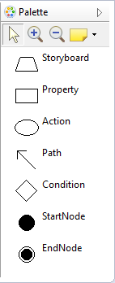

Storyboard and Action are similar within the same diagram. Actions, however, represent atomic operations, whereas Storyboards must have their own diagram consisting possibly of several actions.

Properties are interpreted as parameters of Actions. They have to be connected to some Action of the diagram.

Conditions can be used to split the main flow of a storyboard. Each condition must have exactly two outgoing paths.

Each Storyboard Diagram must have exactly one StartNode and one EndNode. The StartNode is the first node of the diagram and the EndNode is the last node of the diagram.

Finally, Path is used to connect the nodes of the diagram to one another. The have one direction, and in the case of an outgoing Condition path, they also have a label.

Finally the palette is also available at any time at the position of the mouse.

So, the user can select any element from the Palette by clicking on it and place it on the Canvas by clicking once again.

The following figure depicts an example storyboard diagram.

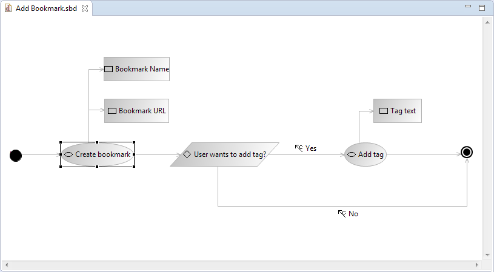

The properties of a diagram element can be changed by clicking on it and changing the values in the Properties editor.

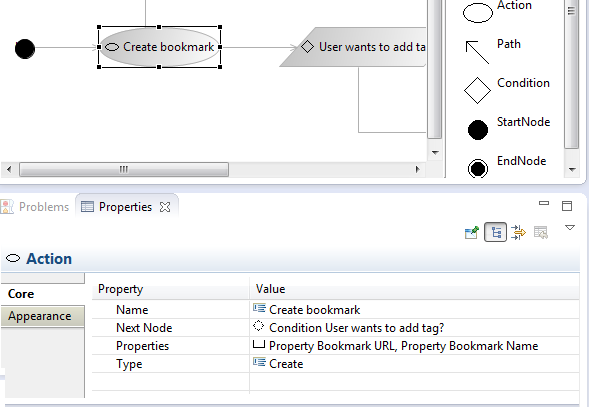

For Action, one can change the name, see the other connected nodes and properties and select the type of the action, out of the 4 CRUD types, Create, Read, Update, and Delete, and the type Other. Most other nodes (and paths) have only a name, while storyboard has also the Precondition option, as the diagram precondition.

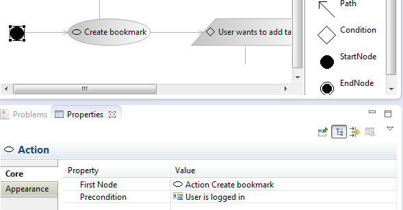

Finally, apart from the properties of a storyboard diagram, the user also has to annotate the diagram actions. This is accomplished using the commands of the right-click context menu of storyboard files. The *Annotate Diagram Instances* option opens the sbd file in Requirements Editor and presents the actions of the diagram to the user so that he/she may annotate them. The *Auto annotate diagram instances* option automatically annotates the text instances using the NLP parser. Finally, the user can select to clear the annotations of a file using the menu option *Clear all annotations*.

##### Validating Storyboards
Storyboard diagrams have specific validation rules. Storyboard Creator checks these rules every time a diagram is saved and presents them in the Problems tab of Eclipse.

Several validation errors are shown in the following figure.

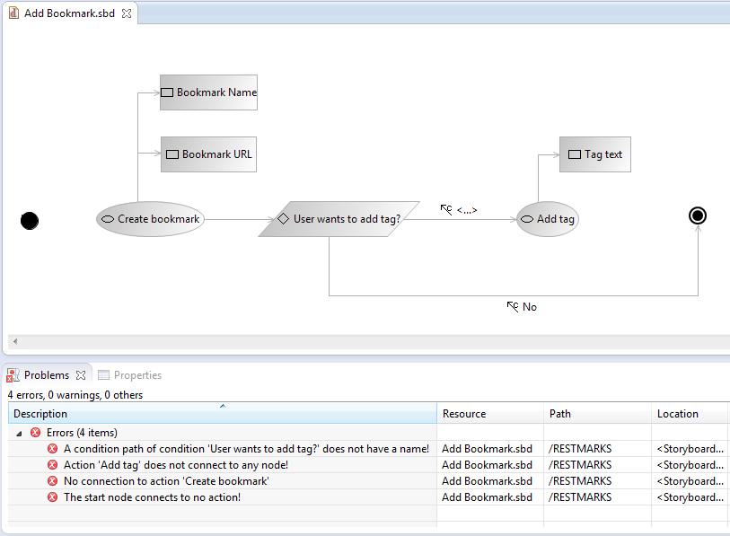

In the above example, the start node does not connect to any node, the Action "Add tag" does not connect to any node, and there is no connection (i.e. possible path) to the Action "Create Bookmark". In addition, a condition path of Condition "User wants to add tag?" does not have a name.

The messages shown by Storyboard Creator are informative, so the user should be able to correct the diagram and upon saving, these messages will disappear.

#### Modeling UML diagrams

##### Importing UML diagram images

To create a new uml file from an image the user should start the import wizard by selecting the option *File > Import..* from the menu. Eclipse presents a list of import wizards, where the user can expand the node "S-CASE" and select "Import UML diagram from image".

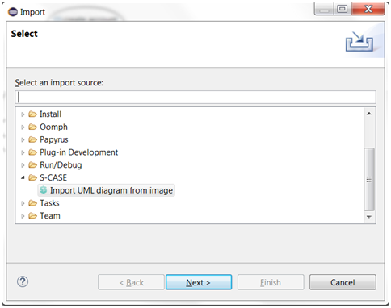

The UML image import wizard is based on a standard Eclipse import wizard. The wizard consists of two pages:
  1. UML diagram image selection,
  2. Export diagram XMI.

The first page asks the user to select an image file containing the diagram, and denote the type of diagram to be detected – activity or use case diagram. Once an image is selected, a preview of the image is shown in the page. Selecting *Next* continues the wizard.

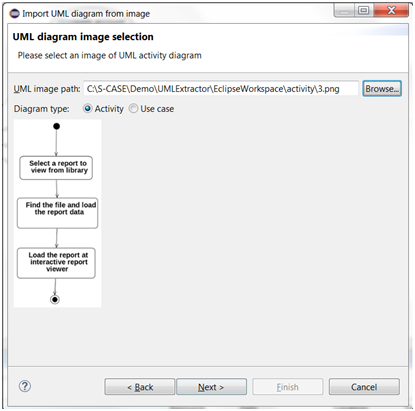

The Export diagram XMI page asks the user to select the location of the resulting model file (a project or a folder in the workspace), and give a *File Name* with a "uml" extension for the resulting file. Selecting the option to open the result in editor will start the associated Eclipse editor (based on the file extension) after the recognition finishes. Several advanced options can also be configured in this page. Note also that by selecting *Advanced<<* and then check the *"Show images"* checkbox, the images resulting from intermediate processing stages of the recognition will be displayed.

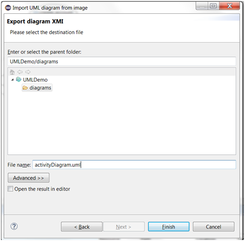

The recognition starts when the user selects the option to ‘Finish’ the wizard. Progress of the recognition can be monitored in the Eclipse view ‘Progress’. The output of the process is stored in the uml file under the specified project/folder that the user has defined in the wizard.

##### Generating Papyrus UML diagrams

The user has also the option to use *Papyrus* to view or edit the created uml file. The user can right-click on the created uml file and select *"Convert to Papyrus Diagrams"*. The Papyrus diagram is generated and opened with Papyrus editor.

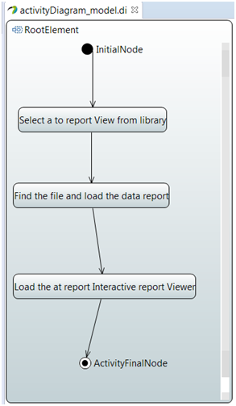

The same process is followed for both activity and use case diagrams.
