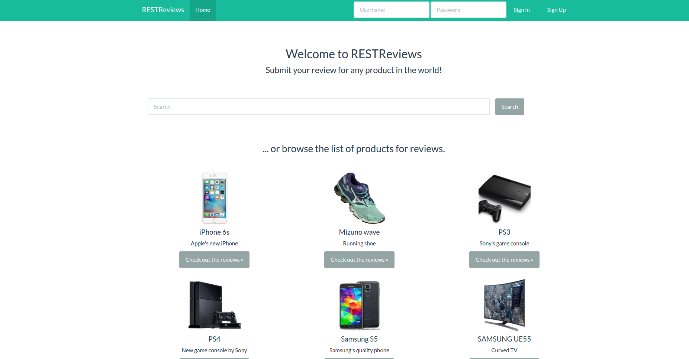

### What is S-CASE

 

**S-CASE - Scaffolding Scalable Software Services** - is an EU funded FP7 research
project that tries to (semi)automatically build RESTful web services out of
multimodal requirements.

 

The S-CASE environment provides software developers with a **step-by-step
methodology from requirements definition to building fully functional software**.

 

The software produced is **tested & documented**, while it inherently supports
features such as **authentication & authorization, full text search, data schema
creation and external 3rd party services integration**.

 

Using state-of-the-art technologies in every step of the process, the S-CASE
Eclipse plugin comprises a credible way to **rapidly scaffold fully functional and
highly sophisticated web services and applications**, while at the same time
**eliminates manual source code typing and debugging time**.

 

Below is RESTReviews, an example application whose back-end was built with S-CASE in just a few minutes.

 

