### Web Service composition

 

The following sections provide an overview of creating web service compositions from Storyboard diagrams or manually.

 

#### Import Storyboard diagrams

 

First, the user has to create a Web Service Composition Storyboard diagram with the Storyboard plugin.

 

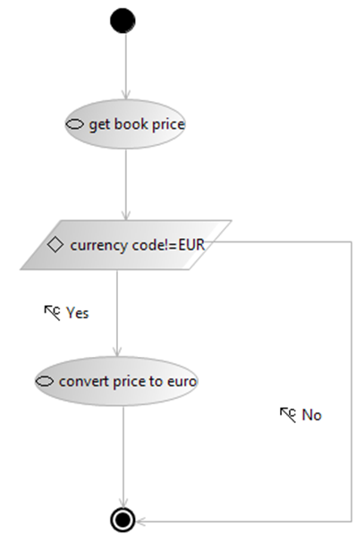

 

Then he/she can select to `Create service composition` from the S-CASE Dashboard panel (or from the appropriate button in the Service Composition View). In the pop-up window that appears the user can choose the appropriate .scd file.

 

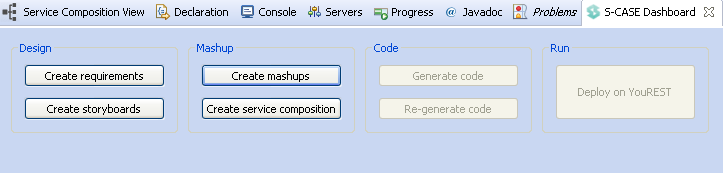

 

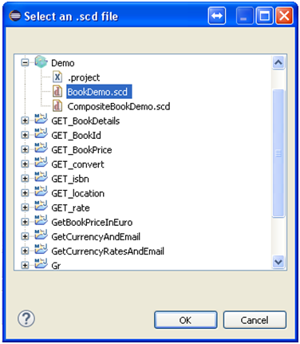

 

Since the user is redirected to the Service Composition View from the Dashboard menu, it is more comfortable to use one of the three buttons in the toolbar  for further working with storyboard files. The one for calling the wizard for creating a new storyboard file (.scd), the one for importing an already created storyboard file in the plugin or the one for reloading the imported storyboard file if the user applies any changes to it.

 

Each action of the storyboard diagram is replaced by the most suitable web service operation, based on the name, the inputs, the outputs and metadata of the operation. More web service operations are also added in the workflow, if they reduce the total number of the workflow’s inputs. So output values of one service can be used as input values for another service and these variables are considered as matched. The above result to the transformed workflow of web services which appears in the View along with a panel on the right, for providing input values for the web services. In the workflow graph, the operation nodes have grey color, the condition nodes cyan, the inputs and outputs of the operations purple and the matched inputs and outputs blue. On the right panel input variables can be WSDL inputs in case of WSDL services and body, query or uri parameters in case of RESTful web services. A panel for the output variables appears also on the right.

 

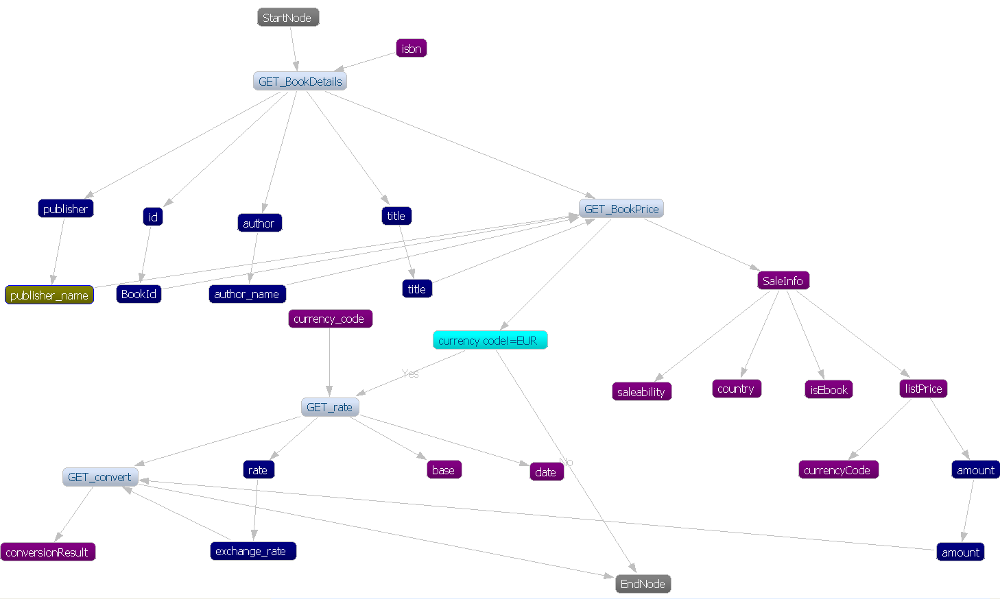

 

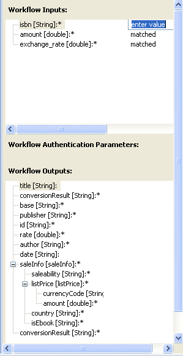

 

The user has also the option to save the produced workflow graph of web services in an xml format in a .sc file and open it at a later time, without the need to re-importing the storyboard file.

 

#### Create manual compositions

 

The user also has the capability to edit the created workflow or create a new one from scratch. In order to create a new workflow the user must press the “Create new workflow”  button  from the toolbar. As a result, a new view appears containing only the Start and End nodes.

 

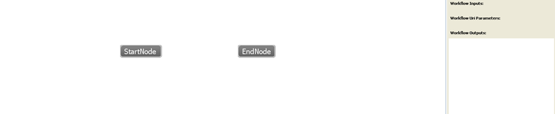

 

By right-clicking on the white canvas of the Service Composition View window, the user can choose to add an operation (web service) or a condition node. If the user chooses to add an operation, a selection window pops up with all the available web services in the ontology, where she/he can choose the operation to be added in the workflow.

 

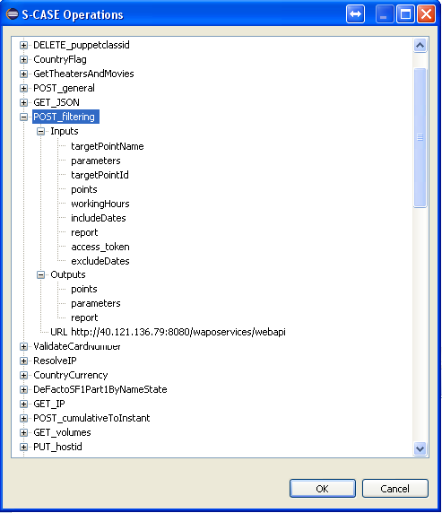

 

If the user chooses to add a condition node, a window pops-up for the user to provide a variable name, which can contain any of the previous service’s outputs names (or similar), a value for the variable and a value-checking expression (with operators <, >, ==, !=).

 

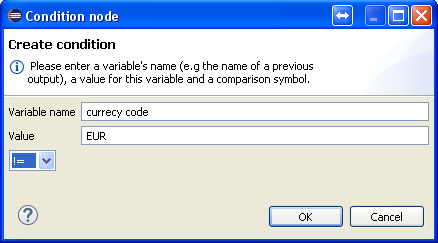

 

Operation, condition, Start and End nodes can all be linked in order to create the final workflow manually, by right clicking on each node. An operation or a Start node can have only one output edge to another operation or condition or End node, while a condition node can have only two output edges, with (dissimilar) text, to two other nodes (operation or condition or Start/End node).

 

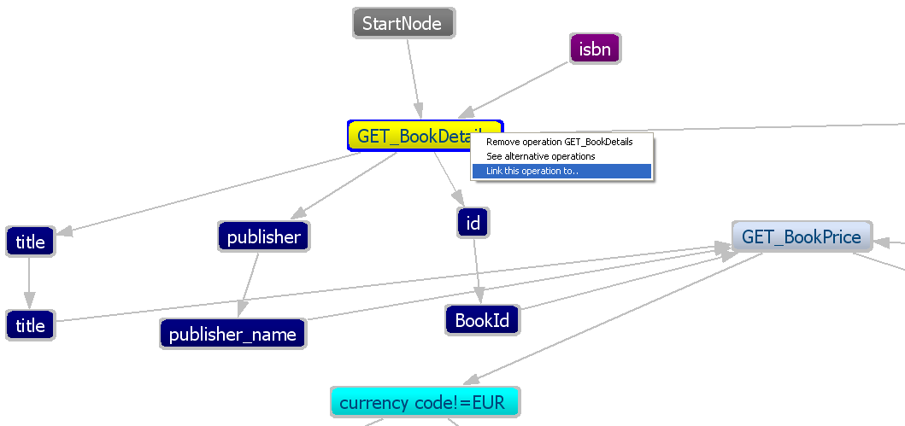

 

Finally, inputs and outputs of services that are considered as similar by the user can be matched and a connection can be created between them.

 

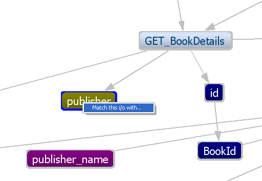

 

Nodes of services and conditions and edges that interconnect them can be deleted. Also,
variables can be unmatched by deleting the edge between them, while edges between
services and input/output variables cannot be deleted. Condition node’s output edges
can be renamed, but cannot both have the same name.

The user has also the option to save the workflow graph of web services that
he/she has created in an xml format in a .sc file and open it at a later time.

 

#### Run the workflow of web services

 

After the workflow is automatically (or manually) generated, the user can choose to execute it. First, he/she has to provide the input values for the web services (also any basic authentication parameters if they exist). The inputs that are not editable get their values from outputs of previous web services to which they are connected (matched). By pressing the “Run Workflow” button  the web services are successively called and the response is assigned to the outputs of the workflow. The flow of execution is shown by highlighting (in yellow) the node that is currently executed. The user can stop the execution at any time by cancelling the Eclipse Job. At the end of the execution all output values are filled and displayed in the right side of the View.

 

#### Generate the code of the composite web service

 

The produced workflow of web services constitutes a single web service and can, thus, be automatically converted into a java RESTful web service. The web service is a Maven, Dynamic Web, Eclipse project. By pressing the  button a window pops-up for the user to specify the new project’s name. If a project with the same name already exists in the workspace, the user is asked if he/she would like to replace it. The project is created in the workspace and can be seen in the Project Explorer window.

 

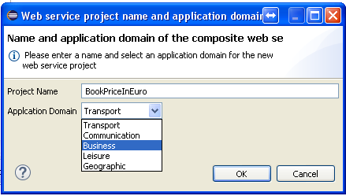
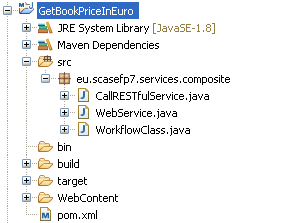

 

#### Deploy composite web service on the S-CASE server

 

By pressing the  button of the toolbar a Maven built is executed in the background, which produces the Web application ARchive (WAR) file of the project. The WAR file takes the name of the project plus the “-0.0.1-SNAPSHOT” ending. Inside the same Eclipse Job  the WAR file is also automatically uploaded and deployed on the web server, provided by Flexiant Cloud for the S-CASE project. If the web service already exists on the server the user is prompted to choose whether he/she would like to update it with the new generated web service. If the user selects “OK” the previous service is deleted and the newer version of it, is transferred to the server. The path of the resource is the IP of the server, slash the name of the WAR file (e.g. http://ServerIP:8080/ProjectName-0.0.1-SNAPSHOT/). In order to call the service, the relative resource path “/rest/result/query”, plus the query parameters and their values need to be added to the above URI.

 

When upload is complete a message is shown to the user asking if the new web service should be registered in YouRest. I the user selects *Yes*, the new composite web service will be available in YouRest and thus could be used for future service compositions. If the user selects *No*, no action is performed and the web service remains available on the S-CASE server.

 

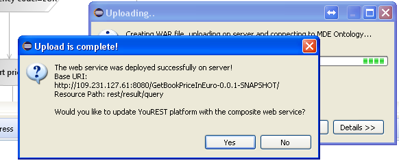

 

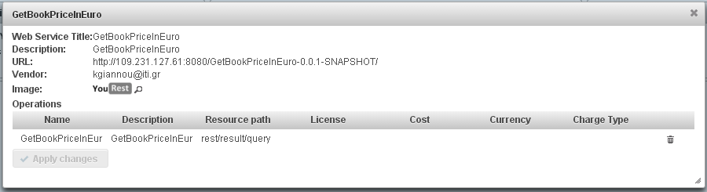
