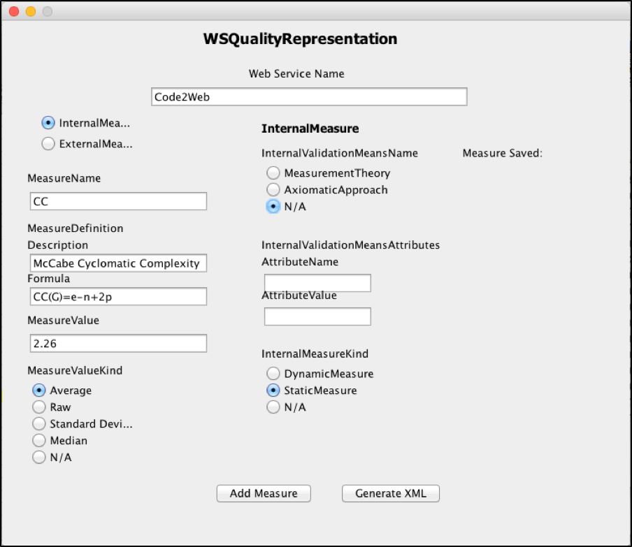
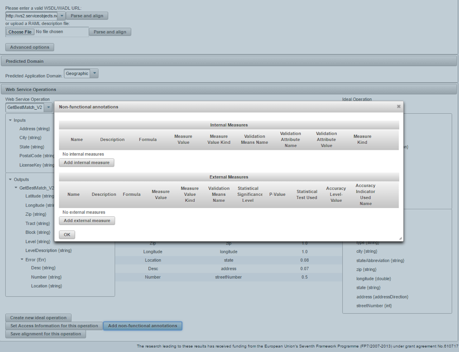
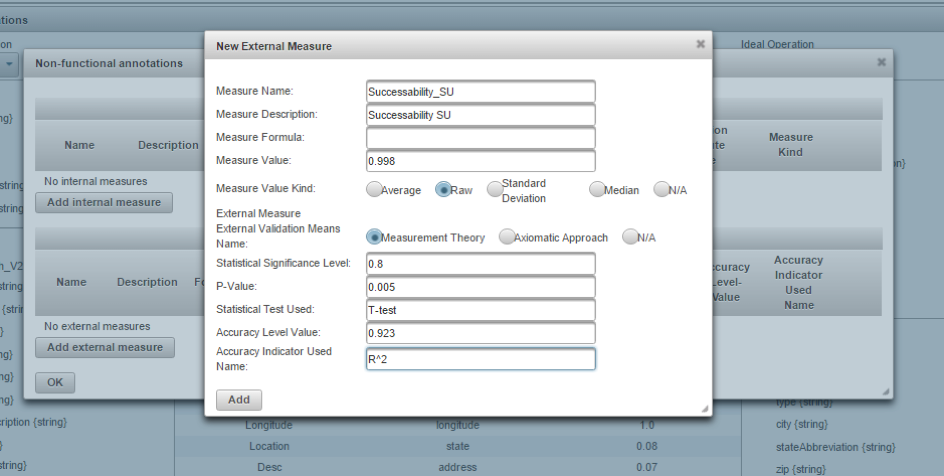
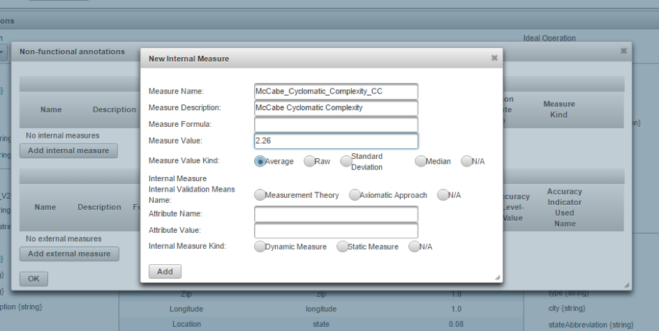
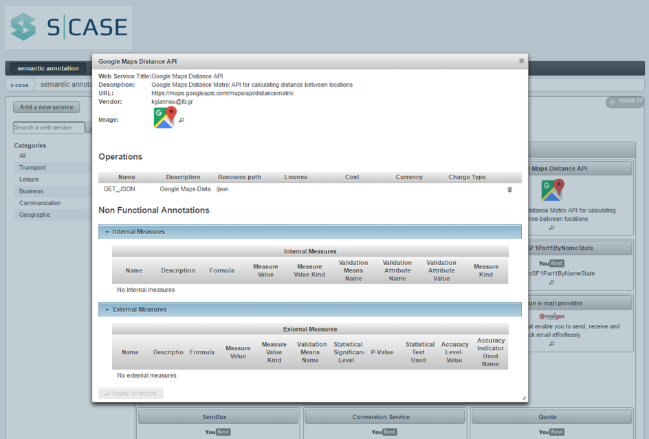

### WSQR (Web Service Quality Representation)

 

The purpose of WSQR is to support developers in creating the XML document that complements their web services under development with WSQR schemas (i.e., non-functional well formed descriptions of the service).
WSQR is released both as a stand-alone tool (as a Java ARchive JAR file) and also as a RESTful Service and API. 

 

#### WSQR stand-alone

 

The initial page of the WSQR can be accessed from the URL https://github.com/s-case/wsqr where to download the wsqr.jar tool (and all related source files).
The tool provides developers with a set of facilities to add a new WSQR representation (as an XML document) by adding internal and external measures and their relations as free text.
Moreover, the WSQR Annotation tool is connected with a set of Java classes that support the instantiation of the WSQR OWL Ontology to add semantic to the WSQR non-functional annotations. 
A set of SPARQL queries have been defined to support developers and web service integrators to reason about non-functional data of target web services 
(e.g., web services under development or third-party web services to be integrated in the business process.)

 

A GUI (Graphical User Interface) supports the annotation process. 
With the WSQR Tool, developers can (1) add a new service and select between internal or external quality measures; 
(2) add new external measures to the representation; 
(3) add new internal measures to the representation; 
(4) when the process of adding internal or external measures is completed, generate the XML document by pushing the Generate XML button.

 

 

A set of examples (annotations) are available at URL http://s-case.github.io/wsqr/examples/

 

#### WSQR RESTful Service

 

The WSQR RESTful Service is provided as an API and integrated directly into the YouREST platform. 
The YouREST platform via the WSQR API provides S-CASE Service Providers with the ability to add seamlessly their web services with non-functional annotations. Moreover, the platform provides S-CASE developers, which need to discover a specific service and integrate it to their workflow, the ability to navigate among equivalent services and then find the services that best fit the functional and non-functional developers’ needs. 
The S-CASE YouREST GUI supports the WSQR annotation process of a service with its non-functional characteristics. Via that GUI, developers can:
(1) Add a new WS into the YouREST platform annotated with the WSQR framework, and then select between internal or external measures to be added.

 

 

Developers can add in a simple way external measures to the representation of their service

 

 

and also new internal measures to the representation. 

 

 

When the process of adding internal or external measures is completed, an XML file is automatically generated and an Ontology associated with the service is generated and populated with all non-functional characteristics of the service. The YouREST platform is updated accorndingly, and the new added service is annotated with all these non-funcitonal characteristics. 

 

Via the S-CASE YouREST GUI, developers can also retrieve non-functional characteristics of a service that could be of interest for an S-CASE software developer or integrator. Suppose that a developer is looking for a map provider API to be integrated into his/her workflow. The developer finds in the S-CASE YouREST Repository, two services that satisfy his/her functional requirements (specifically, the GoogleMapsAPI and the ProviderAMapsAPI). Now, the developer can evaluate the non-functional characteristics of both services to select the best one. The developer can simply retrieve the WSQR annotations associated to each service (in a tabular representation), compare the two specifications, and then decide which service to integrate.

 

 
