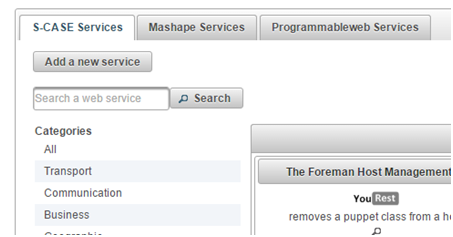

### YouRest web directory application

The purpose of the YouREST web directory application is to provide a centralised interface for advertising the S-CASE Web Services. YouREST provides a catalog of services and a web site to browse and search this catalog. These Web Services may be external services registered by the user in the YouREST platform, or RESTful web services produced by the S-CASE MDE and Web Service Composition mechanisms. The intended user is able to browse all the registered web services to the platform and view their metadata. Searching functionality is also an option.

#### API Description

The initial page of the tool can be accessed from the URL http://yourest.scasefp7.com/ and prompts user to login to the platform.

By selecting “Sign In”, the user may login or create a new account to YouREST platform. In case that the user is not registered, a First/Last/Screen Name and a valid email address should be entered. The text verification should be also inserted for preventing the platform from spamming.

 
 

After a successful login or registration, the user is directed to the main page of the YouREST, where the list of the registered web services are depicted. The home page contains also the list of the application domains, searching functionality and the functionality to register a new web service.

 
 

It should be noted that each web service listed in the home page, may contain multiple web service operations. These operations, along with the web service’s metadata, can be seen by selecting the  button of each web service. The above mentioned information appears in a new popup window.

 
  

In case that the web service belongs to the logged in user (i.e. current user has registered the web service in YouREST), the title, description and the image URL of the web service can be edited. The user can also delete operations of the web service, or even delete the whole web service (by consecutively deleting its operations).

	 
 

It should be noted that the operation delete button is only enabled for the logged in user to whom the web service belongs, as for the edit operation. The searching functionality together with the left panel that contains application domains list, limit the results presented to the user, according to keywords (contained in web service title, description and operation names) or the application domain category that the web service was registered.

The “Add a new service” button, redirects the user to the web service registration page. In this page the user interface of the Web Service Annotation Tool (SAT Tool) has been integrated with YouRest. The user can register a new web service by providing a WSDL/WADL or RAML file. For the semantic annotation of an external web service, a valid URL containing the web service description (for WSDL and WADL documents) or the selection of a RAML document selection is required. Thus, when the user selects a valid web service documentation and selects the Parse and align button, the web service description is parsed in the background and the classification algorithms classify the web service operations according to the three-level categorisation method.

 

 When the parsing and classification background operations are finished the predicted domain, real/ideal matching and i/o matching is computed. The predicted application domain is presented under the Predicted Domain panel as a dropdown menu, in case a user wants to change it.

In case that the web service to be annotated does not belong to any existing application domain, the user may request a new one by selecting Propose a new application domain button. This will open a new dialog, requesting the new domain name and a short description.

Requesting a new application domain, will alert by email the SAT Tool administrator for this request for further actions on integrating all data required in the ontology.
Each operation of the web service is being matched with an ideal operation belonging to the predicted application domain. The operations are presented in a dropdown menu and the user may select and view the desired one.

By selecting one web service operation, the corresponding matched ideal operation is displayed in the right dropdown menu along with the classification score that has been computed by the second-level classification step. The classification score has been computed by the classification algorithms presented, and it is a normalized to [0,1] double value.

It should be noted that the ideal operations presented in the ideal operation dropdown menu is in descending order according to the classification score computed by the classification algorithms.
The inputs and outputs of the web service and ideal operation are presented in a tree-like representation, while the computed alignments are displayed in the two tables.

 
  

For each input/output mappings a normalized to the interval [0,1] score has been assigned according to the classification results of the third-level categorisation. By selecting one row of the mappings, the corresponding concepts in the two trees are highlighted.
It should be noted that one concept from the web service operation can be only aligned with one concept of the ideal operation. The user may fine tune the mappings by dragging one concept from the web service operation tree and drop it to the ideal operation tree.

  

For saving the mappings between one web service operation and an ideal operation, the Save alignment for this operation button should be selected. Then the mappings are saved in the ontology and the operation is considered as aligned.
 
   
   

An already aligned operation cannot be aligned again, except if the alignment is deleted. In this case an error message appears.

 

In case that the ontology ideal operations are not adequate, the user may create new ones per selected application domain. This can be performed by selecting the Create new Ideal Operation button.
A new dialog appears on the page, where the new ideal operation name should be entered. The ideal operation name should be unique, and a warning message will appear if it already exists.

 

Except from the ideal operation name, each new ideal operation should have at least one input and one output. Adding inputs or outputs can be performed by right-click on the Inputs or Outputs nodes.

 

The menu that pop-ups allows the addition of a primitive object, the addition of a non-primitive object or deletion of an inserted object.
For the addition of a new non-primitive object a non-empty object name should be entered. Then the new ideal operation tree is updated accordingly. Adding a new non-primitive object can be performed under the Inputs or Outputs nodes or under an inserted non-primitive object. Additionally, primitive objects can be added under the Inputs or Outputs nodes and under an inserted non-primitive object.

For inserting a new primitive object, the Object name and the data type selected from the predefined objects in the dropdown menu are required.

 

When finishing with the insertion of inputs and outputs of the new ideal operation, the concepts are entered in the ontology, and the dropdown menu, of the ideal operations of the application domain is updated including the new ideal operation. It should be noted that the new ideal operation will be available to all registered users of the YouRest.

The SAT Tool provides also the functionality to declare some IPR policies to each registered web service operation. With these options, the user may add a license to the service or charge for example the use of the service by third-party users.
The Access Info settings are available by selecting the Set Access information for this operation button. The new dialog that opens contains following fields.

-	Service Access Description: A description of the access information
-	Is accessible to countries: A list of the countries that the operation is available to. Selecting multiple countries can be performed by selecting Ctrl button.
-	License name: The license name of the operation
-	License description: The description of the license
-	Is proprietary: Selection if the license is proprietary or not
-	Trial schema: If the use of operation has a trial period
- Duration in days: The number of the free trial days
- Duration in usages: The number of free usages
- Offers full functionality during trial: If the operation is fully operating during the trial period
- Limited Functionality Description: A short description of the trial schema
-	Discount Schemas: Allows the insertion of discount options if the use of the operation is coupled with the use of another operation of the same user
- Paired Service: The paired service that the discount is valid
- Discount Reason: A short description on the discount reason
- Discount (%): The percentage of the discount
By setting the operation access information and saving the alignment, the web service ontology is updated and all the information is stored in the ontology repository. This allows having restrictions and business rules into the registered web services of S-CASE.

#### Connection with public web service directories

YouREST, provides two different tabs for presenting the Mashape and ProgrammableWeb Web Services.
 

Each tab, contain the corresponding web services along with the application domains defined in each Public Web Service Directory. Searching is also a functionality.

 
 
 
 
Each Web Service contains also some metadata as in S-CASE Web services. These can be shown by selecting the button , which displays a dialog that contains all retrieved metadata along with the operations listed in each Web Service.

  

